# Repaso-parcial: *VHDL y LabVIEW*

El presente repositorio contiene los ejercicios de repaso para el segundo parcial del curso de Arquitectura de computadoras 2, Universidad Mariano Gálvez de Guatemala, sede Portales.

## Programa 1: *FlipFlop JK en Active HDL*

Para ello se realiza un programa con las entradas J, K y CLK y con salidas Q y Qn. 
 

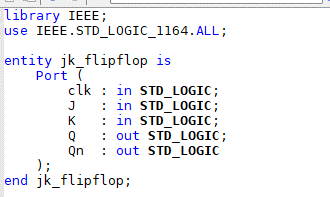

Se definen 4 señales, dos para los valores de salida de las primeras compuertas NAND3 y otras dos para las salidas Q y Qn internas. 

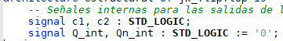
 
Por ultimo se realiza la lógica de las compuertas
 

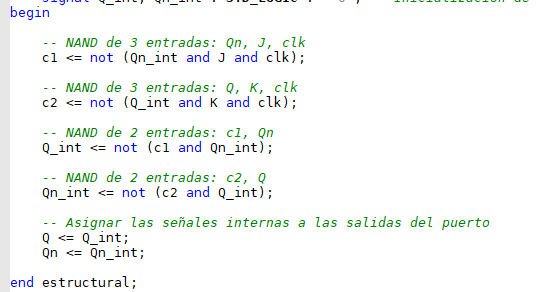

Realice un diagrama de bloques con el ejercicio para poder visualizarlo luego en un WaveForm

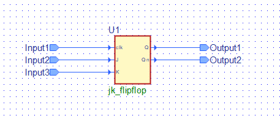
 
Salida del WaveForm con los distintos estados del FlipFlop JK
 

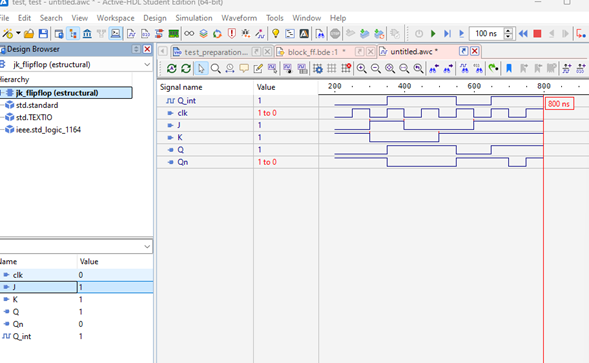

## Programa 2: *Serie de Fibonacci en LabVIEW*

Para realizar la serie de Fibonacci se utilizan distintos elementos de LabVIEW, ciclos y operadores numericos. 

Cada segundo el programa ejecuta un ciclo interno, el cual produce el conjunto de operaciones necesarias para realizar el ciclo. 

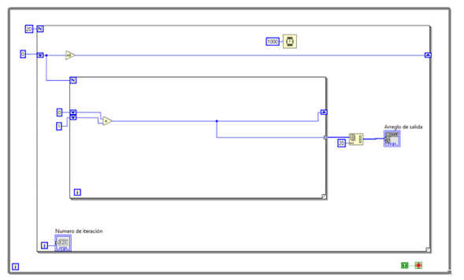

Resultado:
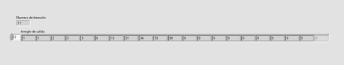

## Programa 3: *Número random 0-1 en LabVIEW*

Se utiliza un elemento propio de LabVIEW el cual genera los numero de forma aleatorio entre 0-1, esto se coloca en un ciclo for para que cada segundo se genere uno nuevo.
 
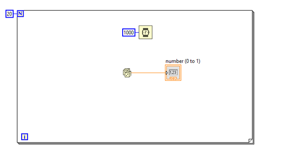

Resultado:
   
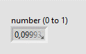 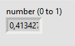 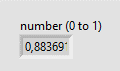